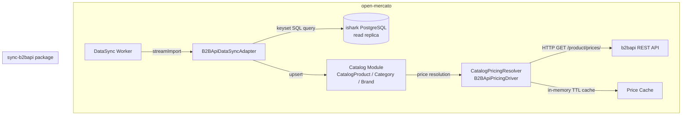

# Design Document: b2bapi Product Integration

## Overview

This design describes a new open-mercato package `sync-b2bapi` that integrates the ishark/b2bapi product catalog into open-mercato. It follows the same `DataSyncAdapter` pattern established by `sync-akeneo`, with two key differences:

1. **Data source**: Direct PostgreSQL connection to the ishark read replica (not a REST API), enabling high-throughput streaming of millions of products via keyset pagination.
2. **Pricing**: Prices are never synced. Instead, a `CatalogPricingResolver` is registered that calls the existing b2bapi `/product/prices/` endpoint at runtime, mirroring the Greencheck live driver pattern.

---

## Architecture



The `sync-b2bapi` package registers two things at startup:
- The `B2BApiDataSyncAdapter` via `registerDataSyncAdapter`
- The `B2BApiPricingDriver` via `registerCatalogPricingResolver`

---

## Components and Interfaces

### 1. `B2BApiDataSyncAdapter` (`lib/adapter.ts`)

Implements `DataSyncAdapter` from `@open-mercato/core/modules/data_sync/lib/adapter`.

```typescript
export const b2bApiDataSyncAdapter: DataSyncAdapter = {
  providerKey: 'b2bapi',
  direction: 'import',
  supportedEntities: ['products', 'categories', 'brands'],
  getMapping,
  validateConnection,
  streamImport,  // AsyncGenerator yielding ImportBatch
}
```

### 2. `B2BApiDbClient` (`lib/db-client.ts`)

Manages the PostgreSQL connection to the ishark read replica using `pg` (node-postgres). Exposes:

```typescript
interface B2BApiDbClient {
  queryProducts(params: {
    frontendId: number
    batchSize: number
    afterUpdatedAt: string | null
    afterId: number | null
  }): Promise<WebsiteProductRow[]>

  queryCategories(params: { frontendId: number }): Promise<CategoryRow[]>
  queryBrands(params: { frontendId: number }): Promise<BrandRow[]>
  countProducts(frontendId: number): Promise<number>
  close(): Promise<void>
}
```

Keyset pagination query for products:
```sql
SELECT id, symbol, part_number, name, short_name, short_description,
       long_description, category_id, brand_id, ean, weight, unit_name,
       is_hidden, is_available, is_suggested, is_promotion, is_new_product,
       thumbnail_path, image_path, custom_1, custom_2, custom_3, custom_4,
       custom_5, custom_6, custom_7, custom_8, updated_at
FROM website_products_view
WHERE frontend_id = $1
  AND (updated_at, id) > ($2, $3)
ORDER BY updated_at ASC, id ASC
LIMIT $4
```

Note: `net_price`, `gross_price`, `default_price_net`, `default_price_gross` are intentionally excluded.

### 3. `B2BApiCatalogImporter` (`lib/catalog-importer.ts`)

Handles upsert logic for products, categories, and brands into open-mercato's catalog module. Mirrors the `createAkeneoImporter` pattern from `sync-akeneo`.

```typescript
interface B2BApiCatalogImporter {
  upsertCategory(row: CategoryRow): Promise<{ localId: string; action: ImportItem['action'] }>
  upsertBrand(row: BrandRow): Promise<{ localId: string; action: ImportItem['action'] }>
  upsertProduct(row: WebsiteProductRow, mapping: B2BApiDataMapping): Promise<ImportItem[]>
  reconcileProducts(seenExternalIds: Set<string>, reconciliation: ReconciliationSettings): Promise<void>
}
```

### 4. `B2BApiPricingDriver` (`lib/pricing-driver.ts`)

Implements `CatalogPricingResolver`. Calls the b2bapi price endpoint and maps the response to a `PriceRow`.

```typescript
export function createB2BApiPricingDriver(config: {
  pricingApiUrl: string
  pricingApiKey: string
  gci: string
  cacheTtlSeconds: number
}): CatalogPricingResolver
```

Price endpoint called:
```
GET {pricingApiUrl}/product/prices/?gci={gci}&cid={customerId}&symbols={symbol}
```

Response mapped to `PriceRow`:
```typescript
{
  amount: price.contractor_net_price ?? price.net_price,
  currency: 'USD',  // configurable
  kind: 'live',
  product: externalId,
}
```

### 5. `cursor.ts`

Encodes/decodes pagination state as JSON:

```typescript
interface B2BApiCursor {
  afterUpdatedAt: string | null  // ISO 8601
  afterId: number | null
  maxUpdatedAt: string | null
}

function encodeCursor(cursor: B2BApiCursor): string  // JSON.stringify
function decodeCursor(raw: string): B2BApiCursor     // JSON.parse + validate
```

### 6. `di.ts`

Package entry point, mirrors `sync-akeneo/di.ts`:

```typescript
export function register(container: AppContainer) {
  registerDataSyncAdapter(b2bApiDataSyncAdapter)
  registerCatalogPricingResolver(createB2BApiPricingDriver(config), { priority: config.pricingPriority })
}
```

---

## Data Models

### Credentials shape (passed via `StreamImportInput.credentials`)

```typescript
interface B2BApiCredentials {
  dbHost: string
  dbPort: number
  dbName: string
  dbUser: string
  dbPassword: string
  frontendId: number
  pricingApiUrl: string
  pricingApiKey: string
  gci: string
  pricingPriority?: number       // default: 0
  pricingCacheTtlSeconds?: number // default: 60
}
```

### Field mapping: `WebsiteProductsView` → `CatalogProduct`

| ishark field | open-mercato field | notes |
|---|---|---|
| `symbol` | `externalId` | match key |
| `name` | `name` | |
| `short_name` | `slug` (derived) | slugified |
| `short_description` | `shortDescription` | |
| `long_description` | `description` | |
| `ean` | `ean` | |
| `weight` | `weight` | |
| `unit_name` | `unitName` | |
| `thumbnail_path` | `thumbnailUrl` | prefixed with media base URL |
| `image_path` | `imageUrl` | prefixed with media base URL |
| `category_id` | `categoryId` | FK to synced category |
| `brand_id` | `brandId` | FK to synced brand |
| `is_available` | `isAvailable` | |
| `is_hidden` | `isActive` (inverted) | |
| `custom_1..8` | `customFields.custom_1..8` | stored as JSON |
| `updated_at` | — | used for cursor only, not stored |
| `net_price` | ❌ excluded | live pricing only |
| `gross_price` | ❌ excluded | live pricing only |

### Cursor state

```typescript
// Encoded as JSON string in ImportBatch.cursor
{
  "afterUpdatedAt": "2024-01-15T10:30:00Z",
  "afterId": 1234567,
  "maxUpdatedAt": "2024-01-15T10:30:00Z"
}
```

---

## Correctness Properties

*A property is a characteristic or behavior that should hold true across all valid executions of a system — essentially, a formal statement about what the system should do. Properties serve as the bridge between human-readable specifications and machine-verifiable correctness guarantees.*

### Property 1: Product mapping completeness and price exclusion

*For any* `WebsiteProductsView` record, the `mapProductToImportItem` function SHALL produce an `ImportItem` whose `data` object contains all mapped non-price fields (name, symbol, ean, weight, etc.) and does NOT contain any of `net_price`, `gross_price`, `default_price_net`, or `default_price_gross`.

**Validates: Requirements 1.2, 3.4**

---

### Property 2: Sync idempotence (upsert)

*For any* set of products synced twice in sequence with identical source data, the total count of `CatalogProduct` records in open-mercato after the second sync SHALL equal the count after the first sync (no duplicates created).

**Validates: Requirements 1.3**

---

### Property 3: Reconciliation removes absent products

*For any* open-mercato catalog state containing products A, B, C, after a full sync that only returns products A and B, product C SHALL be marked inactive (not deleted) in open-mercato.

**Validates: Requirements 1.5**

---

### Property 4: Cursor round-trip

*For any* valid `B2BApiCursor` object, `decodeCursor(encodeCursor(cursor))` SHALL produce an object deeply equal to the original cursor.

**Validates: Requirements 7.1, 7.2**

---

### Property 5: Incremental sync filters by `updated_at`

*For any* set of products with known `updated_at` timestamps and a cursor encoding timestamp T, the incremental sync SHALL return only products where `updated_at > T`, and SHALL NOT return any product where `updated_at <= T`.

**Validates: Requirements 2.3**

---

### Property 6: Resume without duplicates

*For any* sync run interrupted after batch K and resumed with the cursor from batch K, the union of `externalId` values from the first run (batches 0..K) and the resumed run SHALL contain no duplicate `externalId` values.

**Validates: Requirements 2.2**

---

### Property 7: Keyset pagination query shape

*For any* call to `B2BApiDbClient.queryProducts` with non-null `afterUpdatedAt` and `afterId`, the generated SQL query SHALL contain a `WHERE (updated_at, id) > ($2, $3)` clause and SHALL NOT contain an `OFFSET` clause.

**Validates: Requirements 3.1**

---

### Property 8: BatchSize clamping

*For any* `batchSize` value greater than 1000, the adapter SHALL clamp the effective batch size to 1000. *For any* `batchSize` value between 1 and 1000 inclusive, the adapter SHALL use the provided value unchanged.

**Validates: Requirements 3.3**

---

### Property 9: Category hierarchy preservation

*For any* set of ishark categories with dot-separated `path` fields, after syncing, every category in open-mercato SHALL have a `parentId` that matches the open-mercato ID of the category corresponding to the immediate parent in the ishark path.

**Validates: Requirements 4.4**

---

### Property 10: Pricing driver returns valid PriceRow for valid API response

*For any* valid b2bapi price API response containing `net_price` or `contractor_net_price`, the `B2BApiPricingDriver` SHALL return a `PriceRow` with a non-null `amount` field and a `kind` of `'live'`.

**Validates: Requirements 5.1, 5.2**

---

### Property 11: Pricing driver caching idempotence

*For any* `(symbol, customerId)` pair, calling the `B2BApiPricingDriver` twice within the configured TTL SHALL result in exactly one HTTP request to the b2bapi price endpoint (the second call uses the cached result).

**Validates: Requirements 5.5**

---

### Property 12: Credentials validation

*For any* credentials object missing one or more required fields (`dbHost`, `dbPort`, `dbName`, `dbUser`, `dbPassword`, `frontendId`, `pricingApiUrl`, `pricingApiKey`, `gci`), the adapter SHALL throw a validation error before attempting any database connection.

**Validates: Requirements 8.3**

---

## Error Handling

| Scenario | Behavior |
|---|---|
| DB connection failure at sync start | `validateConnection` returns `{ ok: false, message }` |
| DB query error mid-stream | Batch emitted with `action: 'failed'` items; sync continues |
| Pricing API timeout | Driver returns `null`; open-mercato falls back to next resolver |
| Pricing API non-2xx | Driver returns `null`; error logged |
| Missing category/brand during product upsert | Category/brand created on-the-fly before product |
| Invalid cursor string | `decodeCursor` throws; sync restarts from beginning |
| `batchSize` > 1000 | Clamped to 1000 silently |

---

## Testing Strategy

### Property-Based Testing

The property-based testing library for this package is **[fast-check](https://github.com/dubzzz/fast-check)** (already used in the open-mercato monorepo). Each property test runs a minimum of 100 iterations.

Each property-based test MUST be tagged with:
```
// **Feature: b2bapi-product-integration, Property {N}: {property_text}**
```

Properties 1–12 above each map to exactly one property-based test. Generators will produce:
- Random `WebsiteProductsView`-shaped objects (for mapping tests)
- Random cursor objects with valid ISO timestamps and integer IDs
- Random product sets with known `updated_at` distributions
- Random category trees with dot-separated paths
- Random b2bapi price API response shapes

### Unit Tests

Unit tests cover:
- `encodeCursor` / `decodeCursor` with specific known values and edge cases (null fields, empty string)
- `validateConnection` happy path and error path (mocked DB)
- `B2BApiPricingDriver` error handling (timeout, 404, 500)
- `mapProductToImportItem` with a specific known product record
- Credentials validation with specific missing-field examples

### Integration Tests

Integration tests (optional, require a test DB) cover:
- Full sync of a small product set (< 100 products) against a real PostgreSQL instance seeded with test data
- Incremental sync after updating a subset of products
- Reconciliation after removing products from the source
